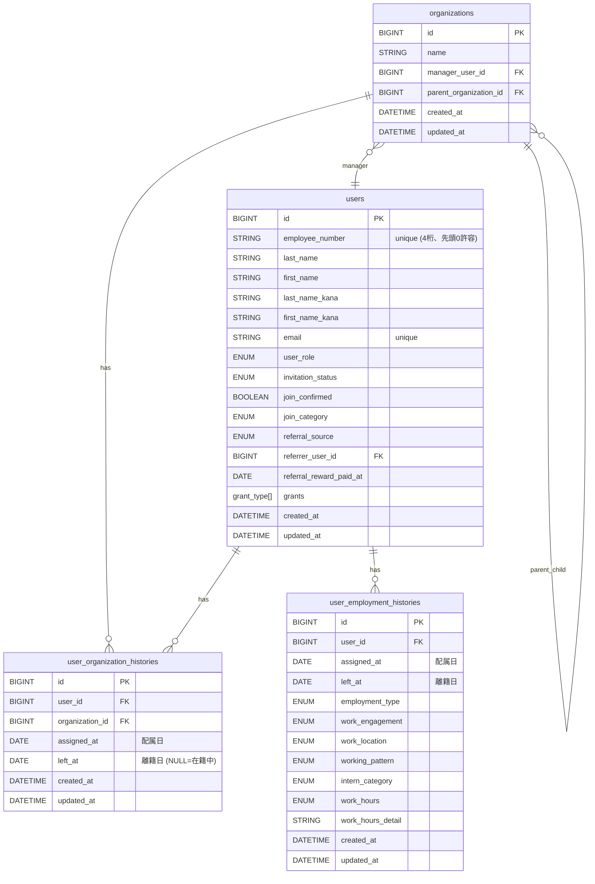

```mermaid
erDiagram
    users {
        BIGINT id PK
        STRING employee_number "unique (4桁、先頭0許容)"
        STRING last_name
        STRING first_name
        STRING last_name_kana
        STRING first_name_kana
        STRING email "unique"
        ENUM user_role
        ENUM invitation_status
        BOOLEAN join_confirmed
        ENUM join_category
        ENUM referral_source
        BIGINT referrer_user_id FK
        DATE referral_reward_paid_at
        grant_type[] grants
        DATETIME created_at
        DATETIME updated_at
    }

    organizations {
        BIGINT id PK
        STRING name
        BIGINT manager_user_id FK
        BIGINT parent_organization_id FK
        DATETIME created_at
        DATETIME updated_at
    }

    user_organization_histories {
        BIGINT id PK
        BIGINT user_id FK
        BIGINT organization_id FK
        DATE assigned_at "配属日"
        DATE left_at "離籍日 (NULL=在籍中)"
        DATETIME created_at
        DATETIME updated_at
    }

    user_employment_histories {
        BIGINT id PK
        BIGINT user_id FK
        DATE assigned_at "配属日"
        DATE left_at "離籍日"
        ENUM employment_type
        ENUM work_engagement
        ENUM work_location
        ENUM working_pattern
        ENUM intern_category
        ENUM work_hours
        STRING work_hours_detail
        DATETIME created_at
        DATETIME updated_at
    }

    %% Relationships
    users ||--o{ user_organization_histories : has
    organizations ||--o{ user_organization_histories : has
    organizations }o--|| users : manager
    organizations ||--o{ organizations : parent_child

    users ||--o{ user_employment_histories : has

    %% PostgreSQL ENUM definitions (conceptual)
    %% user_role:              ['admin', 'writer', 'reader']
    %% invitation_status:      ['invited', 'registered']
    %% join_category:          ['新卒', '中途']
    %% employment_type:        ['役員','正社員','契約社員_有期','契約社員_トライアル','アルバイト','業務委託']
    %% work_engagement:        ['常駐','非常駐']
    %% work_location:          ['東京本社','大阪支社','在宅']
    %% working_pattern:        ['変形労働時間制_WAL型','完全週休二日制_WLB型','シフト制']
    %% intern_category:        ['インターン','内定者インターン']
    %% work_hours:             ['9_18','10_19','フレックス','その他']
    %% referral_source:        ['人材紹介','リファーラル','求人広告','ハローワーク','スカウト媒体']
    %% grant_type:             ['人開金_人材育成支援','トライアル雇_障がい者_特開金','特開金_特定就職困難者','キャリアアップ_正社員化',
    %%                          '人開金_人への投資促進','人開金_事業展開等リスキリング']
```